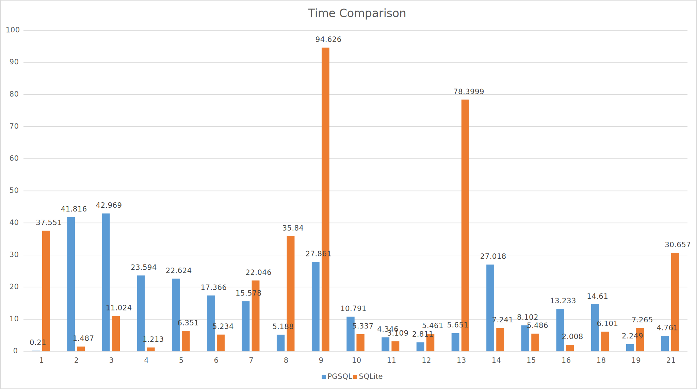

This is the directory for the S2021 ACS final project.  
Compare the performance of PostgreSQL and SQLite on Raspberry Pi 4B 2GB RAM version.  
Yutong Xie: SQLite  
Yilu Zhou: PostgreSQL

# Database Benchmark Tool: TPC-H  
TPC-H is a decision support benchmark. It consists of a suite of business oriented ad-hoc queries and concurrent data modifications. The queries and the data populating the database have been chosen to have broad industry-wide relevance.

# Testing Device: Raspberry Pi 4B with 2GB RAM  
- Broadcom BCM2711, Quad core Cortex-A72 (ARM v8) 64-bit SoC @ 1.5GHz.
- 2GB LPDDR4-3200 SDRAM.
- Sandisk 32GB U1, A1, class10 TF card SDSQUNC-032G-ZN3MN. Read: 120MB/s Write: 10MB/s.
- Heat sink and fan to prevent thermal throttling.
- Raspberry Pi OS with desktop 32-bit. Kernel version: 5.10.

# Testing Database
## PostgreSQL
- A free and open-source relational database management system emphasizing extensibility and SQL compliance.
- Transactions with Atomicity, Consistency, Isolation, Durability (ACID) to guarantee data validity despite errors, power failures.
- Evolved from the Ingres project at the University of California, Berkeley.
- Version: 13.2.

## SQLite3
- Not a client–server database engine.
- ACID-compliant and implements most of the SQL standard, generally following PostgreSQL syntax.
- A popular choice as embedded database software for local/client storage in application software such as web browsers. 
- Version: 3.35.5.

# Database Description
First a new database is created for both PostgreSQL and SQLite. Then, we use TPC-H to generate test data. The size of the data is about 1GB using a scale factor of 1. The data are separated in 8 different tables.

|Table Name|Number of Tuples|
|----|----|
|region|5|
|nation|25|
|partsupp|800,000|
|customer|150,000|
|lineitem|6,001,215|
|orders|1,500,000|
|part|200,000|
|supplier|10,000|

The schema can be described as:

Source: [TPC BENCHMARK H (Decision Support) Standard Specification Revision 2.18.0](http://www.tpc.org/tpc_documents_current_versions/pdf/tpc-h_v2.18.0.pdf) 

After the *.tbl data files are generated, they are imported into the tables of the test database.

# Query Description
Then we use the same queries provided by TPC-H to test the performance of the databases. Because there are some differences in querying between PostgreSQL and SQLite, two different versions of queries are generated by TPC-H for compatibility. The queries can be found in the PGSQL_Queries and SQLITE_Queries. A general definitions of the queries are listed below:
|Query Number|Type|Description| 
|------------|----|------|
|1|Pricing Summary Report|This query reports the amount of business that was billed, shipped, and returned.|
|2|Minimum Cost Supplier|This query finds which supplier should be selected to place an order for a given part in a given region.|
|3|Shipping Priority|This query retrieves the 10 unshipped orders with the highest value.|
|4|Order Priority Checking|This query determines how well the order priority system is working and gives an assessment of customer satisfaction.|
|5|Local Supplier Volume|This query lists the revenue volume done through local suppliers.|
|6|Forecasting Revenue Change|This query quantifies the amount of revenue increase that would have resulted from eliminating certain company-wide discounts in a given percentage range in a given year. Asking this type of "what if" query can be used to look for ways to increase revenues.|
|7|Volume Shipping|This query determines the value of goods shipped between certain nations to help in the re-negotiation of shipping contracts.|
|8|National Market Share|This query determines how the market share of a given nation within a given region has changed over two years for a given part type.|
|9|Product Type Profit Measure|This query determines how much profit is made on a given line of parts, broken out by supplier nation and year.|
|10|Returned Item Reporting|The query identifies customers who might be having problems with the parts that are shipped to them.|
|11|Important Stock Identification|This query finds the most important subset of suppliers' stock in a given nation.|
|12|Shipping Modes and Order Priority|This query determines whether selecting less expensive modes of shipping is negatively affecting the critical-prior-ity orders by causing more parts to be received by customers after the committed date.|
|13|Customer Distribution|This query seeks relationships between customers and the size of their orders.|
|14|Promotion Effect|This query monitors the market response to a promotion such as TV advertisements or a special campaign.|
|15|Top Supplier|This query determines the top supplier so it can be rewarded, given more business, or identified for special recognition.|
|16|Parts/Supplier Relationship|This query finds out how many suppliers can supply parts with given attributes. It might be used, for example, to determine whether there is a sufficient number of suppliers for heavily ordered parts.|
|17|Small-Quantity-Order Revenue|This query determines how much average yearly revenue would be lost if orders were no longer filled for small quantities of certain parts. This may reduce overhead expenses by concentrating sales on larger shipments.|
|18|Large Volume Customer|The Large Volume Customer Query ranks customers based on their having placed a large quantity order. Large quantity orders are defined as those orders whose total quantity is above a certain level.|
|19|Discounted Revenue|The Discounted Revenue Query reports the gross discounted revenue attributed to the sale of selected parts handled in a particular manner. This query is an example of code such as might be produced programmatically by a data mining tool.|
|20|Potential Part Promotion|The Potential Part Promotion Query identifies suppliers in a particular nation having selected parts that may be candidates for a promotional offer.|
|21|Suppliers Who Kept Orders Waiting|This query identifies certain suppliers who were not able to ship required parts in a timely manner.|
|22|Global Sales Opportunity|The Global Sales Opportunity Query identifies geographies where there are customers who may be likely to make a purchase.|

Source: [TPC BENCHMARK H (Decision Support) Standard Specification Revision 2.18.0](http://www.tpc.org/tpc_documents_current_versions/pdf/tpc-h_v2.18.0.pdf) 

# Test Results
The time for each query are also recorded using time command of Linux.

|Query Number|Type|PostgreSQL Time(s)|SQLite Time(s)|
|-------|-----------|--------------|----------|
1|Pricing Summary Report|0.21|37.551|
2|Minimum Cost Supplier|41.816|1.487|
3|Shipping Priority|42.969|11.024|
4|Order Priority Checking|23.594|1.213|
5|Local Supplier Volume|22.624|6.351|
6|Forecasting Revenue Change|17.366|5.234|
7|Volume Shipping|15.578|22.046|
8|National Market Share|5.188|35.84|
9|Product Type Profit Measure|27.861|94.626|
10|Returned Item Reporting|10.791|5.337|
11|Important Stock Identification|4.346|3.109|
12|Shipping Modes and Order Priority|2.811|5.461|
13|Customer Distribution|5.651|78.3999|
14|Promotion Effect|27.018|7.241|
15|Top Supplier|8.102|5.486|
16|Parts/Supplier Relationship|13.233|2.008|
~~17~~|~~Small-Quantity-Order Revenue~~|~~N/A~~|~~N/A~~|
18|Large Volume Customer|14.61|6.101|
19|Discounted Revenue|2.249|7.265|
~~20~~|~~Potential Part Promotion~~|~~N/A~~|~~N/A~~|
21|Supplier Who Kept Orders Waiting|4.761|30.657|
~~22~~|~~Global Sales Opportunity~~|~~1.629~~|~~N/A~~|
| |Average|15.30410526|19.28615263|
| |Standard Deviation|12.45593892|25.74306548|

It is worth noting that for query 17 and 20, both database cannot complete the query in 15 minutes. For query 22, SQLite cannot complete the query in 15 minutes. As a result, query 17, 20, and 22 are not considered in final performance comparison.

# Conclusion
PostgreSQL will fork a new process each time a new client is connected. As a result, for simple read-heavy operations, such as the TPC-H test queries, PostgreSQL is worse in performance than other RDMBSs.  However, PostgreSQL has been fill ACID-compliant since 2001 and it implements multi-version currency control to ensure that data remains consistent.  
SQLite3 uses a serverless approach. Any process that accesses the database reads from and writes to the database disk file directly. As a result, there is no need to configure a server process like PostgreSQL. The whole database is stored as a separate file and can be located anywhere in the system. It can also be shared to other systems seamlessly.  
From the testing result, we can find that on average, PostgreSQL spends 4 seconds less than that of SQLite3. Also, the standard deviation is much smaller for PostgreSQL than for SQLite3. This indicates that PostgreSQL has a better overall performance compared to SQLite3. This can be caused by the slow disk read/write performance. For Raspberry Pi, the micro-sd cards are used as the storage devices. The best micro-sd cards on the market can provide 100MB/s read and write speed. This is equivalent to the speed of HDD drives. Modern data centers can use better storage devices, such as NVMe drives and RAID to improve the speed of the storage devices. As a result, when using better storage devices, the performance for SQLite3 can be improved.

# Reference
[TPC-H Database for SQLite](https://github.com/lovasoa/TPCH-sqlite)  
[TPC-H for PostgreSQL](https://blog.csdn.net/iteapoy/article/details/104214119)  
[TPC-H Official Website](http://www.tpc.org/tpch/)