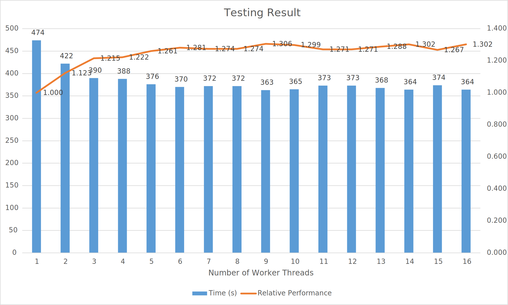

# Introduction
The requirement of the mini project is to design a program which can utilize multiple threads to accelerate the time required to compress a file. Because C/C++ does not have built-in support for multi-threaded application, pthread library from Linux is used to implement the application. As a result, this program can only run on Linux systems. Although with the use of msys2, this program can also be compiled and executed on Windows as well with no problem. 

# Functions
- Compress a file using multiple worker threads.
- Decompress a file using one worker threads.

# Usage
This application can only run on Linux system. Windows operating system is not recommended as pthread library is not officially supported on Windows. 
## Configure number of worker threads
To change the number of threads the program will use for compression, change the last argument for the compression mode:  
`./compression.out [-c] [log] [input] [output] [number_threads]`  
with the number of threads needed. Please note that more threads will not necessarily make the program run faster.

## Compile
To compile the source code, run  
`g++ -pthread compression.cpp -o compression.out -lz`  
in the terminal. Please ensure that pthread and zlib are available in the system.

## Execute
To execute the compiled program, run  
`./compression.out [-c/-u] [log] [input] [output] [number_threads]`  
in the terminal with arguments:
- `-c`: compression mode, compress the `input` into `log` and `output`.
- `-u`: decompression mode, decompress the `input` and read `log` to recover to `output`.
- `log`: the file used to record the beginning position of each compressed data block. ***In compression mode, the file with the same name will be deleted.*** 
- `input`: the name of the input file. In compression mode, this is the source file you want to compress. In decompression mode, this is the compressed file you want to decompress.
- `output`: the name of the output file. In compression mode, this is the destination file you want the compressed file to be. In decompression mode, this is the destination you want the decompressed file to be. ***The file with the same name will be deleted in both compression and decompression mode.***
- `number_threads`: the number of worker threads the program will use to compress the file. ***Ignore this argument when in decompression mode.***

# Main Function
This program will take 6 arguments for compression mode in the format of  
`./compression.out [-c] [log] [input] [output] [number_threads]`.  
and 5 arguments for decompression mode in the format of  
`./compression.out [-u] [log] [input] [output]`.  
`-c` indicated the compression mode and `-u` indicated te decompression mode. `log` is the log file which will be used to decompress the file. It is impossible to decompress the file using traditional method. Therefore, `log` can also be viewed as the key to the compressed file. `input` is the name of the input file and `output` is the name of the output file. Please note that `log`, `input` and `output` may be deleted by the program to avoid data corruption even before the compression and decompression process. `number_threads` will be the number of worker threads used in the compression mode.
- In the compression mode, the `input` file will be read by the `read_file` function. `log` and `output` file will be deleted first and opened as output stream. In every execution cycle, `number_threads` threads will be created with `thread_id` from 0 to `number_threads`-1. After these threads are created, the program will wait for them to complete. Their `result_file_segment` will be collected from their corresponding `thread_data` structure. Then the `result_file_segment` will be written to `output` file and the size of `result_file_segment` will be written to `log` file for the decompression use in order of `thread_id`. After this cycle completed, the program will continue the process by resetting the `thread_id` to 0.
- In the decompression mode, the `input` and `log` file will be read by the program. `input` will be read into the memory space and `log` will be read one line at a time. Each line of `log` file will be the size of the `result_file_segment` from the compression mode. Therefore, the program will read `input` from `beg` to `beg`+number from `log`. After the compressed data block is read, `block_decompression` will be called to decompress the block, the result will be written to the `output` file. `output` file will be deleted first before the written happens to avoid data corruption. 

# Member Functions
## `#define BUFFER_SIZE 4096`
Defines the size of the buffer as 4096 bytes stated in Project2.pdf. It is possible to change the buffer size, but there is no guarantee that the program will work correctly.
## `typedef unsigned char BYTE`
To simplify the code, BYTE is defined as unsigned char to represent the characters in the input file.
## `struct thread_data`
The variables in this structure will be sent to each individual threads as an IO. `thread_id` defines the id of the thread, `input_file_segment` is the block from the input file. `result_file_segment` is the result of the compressed block.
## `std::vector<BYTE> read_file(const char *input_file_name)`
This function will read the file and convert the file into a vector of `BYTE`. It will return a `std::vector<BYTE>` of the content of the input file. Each character will be represented as a BYTE in the vector. `input_file_name` is the name of the file to be vectorized.
## `void buffer_vector_converter(std::vector<BYTE> &vector, const BYTE *buffer, uLongf length)`
This function will covert the `buffer` to a vector of BYTE.
`vector` is the destination vector. `length` is the size of the input buffer. This function is useful when converting array of `BYTE` to vector of `BYTE`.
## `int compress_vector(std::vector<BYTE> source, std::vector<BYTE> &destination)`
This function will compress the vector using compress2 function. It will return the `return_value` from `compress2` function. `source` is the source vector containing the data from the input file. `destination` is the vector designated to hold the result of the `compress2` function. The function will first get the size of the `source`. Then it will calculate the size of the `source` after the compression using `compressBound` function from zlib. Memory space will be allocated to be used by `compress2` function. Formatted `source` will be sent to `compress2` function and compressed result will be sent to the allocated memory space. By calling `buffer_vector_converter` function, the data in the allocated memory space will be converted into a vector. The `return_value` from `compress2` will be sent back to determine whether the compress process is successful or not.
## `int decompress_vector(std::vector<BYTE> source, std::vector<BYTE> &destination)` 
This function will decompress the vector using `uncompress` function from zlib. As input_file is separated into 4KB blocks. 4096 bytes will be the maximum size the decompressed data will be. Thus, 4096 bytes of memory space will be assigned as the destination of the `uncompress` function. `source` will also be formatted from vector to array and sent into `uncompress` as well. Finally, similar to `compress_vector` function, the memory space will be converted to vector by calling `buffer_vector_converter`.
## `void *block_compression(void *threadargs)`
This is the function each thread will execute. It will first read the data from `threadargs` sent by `main` function. Then a `result` vector wil be created to hold the compressed block. Then it will call `compress_vector` function to compress the 4KB block. The result from the `compress_vector` function will be write back to `result_file_segment` in the `threadargs`.
## `std::vector<BYTE> block_decompression(std::vector<BYTE> input)` 
This is the function used to decompress the input file. The input file is in the format of `std::vector<BYTE>`. It will call `decompress_vector` function to decompress the `input` data and returns the `result`, the decompressed file segment, to the `main` function.
  
# Testing
## Testing Configuration
- CPU: Intel Core i7-10700KF
- GPU: Nvidia Geforce 1660 Super
- RAM: 64GB DDR4 Memory
- OS:  MSYS2 on Windows 10 Pro 64-bit
- Input File: DataPC_ACD_Greece.forge (~10 GB) from Assassin's Creed Odyssey by Ubisoft.

## Testing Result
- Original File Size: 10,026,549,248 Bytes
- Compressed Main File Size: 9,593,604,175 Bytes
- Log File Size: 12,235,263 Bytes
- Compression Rate: 1.0451
  
| Number of Worker Threads | Time (s) | Relative Performance |
|--------------------------|----------|----------------------|
| 1 | 474 | 1.000 |
| 2 | 422 | 1.123 |
| 3 | 390 | 1.215 |
| 4 | 388 | 1.222 |
| 5 | 376 | 1.261 |
| 6 | 370 | 1.281 |
| 7 | 372 | 1.274 |
| 8 | 372 | 1.274 |
| 9 | 363 | 1.306 |
| 10 | 365 | 1.299 |
| 11 | 373 | 1.271 |
| 12 | 373 | 1.271 |
| 13 | 368 | 1.288 |
| 14 | 364 | 1.302 |
| 15 | 374 | 1.267 |
| 16 | 364 | 1.302 |

Note: Please ensure the testing file can be stored in the memory space. If not, the operating system may use the swap space to store the file, potentially reduce the performance. Also, the time taken to read the file into the memory is not counted into the time recorded as it depends on the disk type (HDD or SSD).

# Conclusion
From the results, we can observe that when 6 worker threads are used, the performance is increased by 28%. However, when 16 threads are used, the performance only increases about 30%, similar to 6 worker threads. Also, after 6 worker threads, when the number of worker threads increases, the performance does not seem to improve a lot. This is caused by the longer time the program needed to wait for more threads to finish processing the data. The write to file process limits the overall performance of the program. To further improve the performance, the programmer can design the code to split the input file into `number_threads` pieces and each thread gets their own data. After finishing compression, each thread can write to the file independently instead of returning the data back to the main process.  
It is also worth noting that the maximum performance boost compared to single thread scenario is only 30%, indicating that multi-thread technique has diminishing returns. 4 to 6 threads are enough to handle the compression with similar performance of 16 threads.

