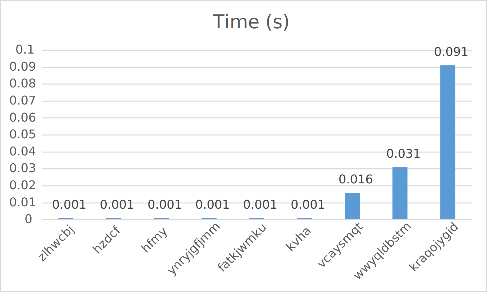

# Introduction
This mini-project implements a dictionary decoder. Dictionary decoding is widely used to compress data with low cardinality. The decoder will scan the original data to build the dictionary that consists all the unique data items, and then replaces each data item with the location ID in the dictionary. Hash table or B-tree are widely used indexing data structures to accelerate dictionary look-up. 

# Usage
***Linux is needed to run the program.***  
To compile the program, run  
`g++ main.cpp -o main.out`   
in the terminal window.  
After finishing compilation, to find all supported commands, run  
`./main.out` 
Time will be recorded for comparison.
## Encode
In encode more, the program will read the raw data column and convert the data items to the location IDs in the dictionary. The dictionary and the encoded data column will be stored in the same file.  
To run the encode mode, type  
`./main.out -e [original] [result]`  
in the terminal window.  
`[original]`: the raw data column. For demonstration, this will be `Large-Size-Column.txt`.  
`[result]`: the desired name of the output file. The output file is consisted of both the dictionary and encoded data column. For demonstration, this will be `result.txt`.  
Besides the `[original]` and `[result]`, `temp1` and `temp2` will be used by the program to store temporary information. ***Please ensure that there is no file named `temp1` or `temp2` in the same directory.*** Otherwise the file will be deleted by the program after running the encode mode.  
For example, if the user wants to encode the raw column file `Large-Size-Column.txt`, run `./main.out -e Large-Size-Column.txt result.txt` and the program will generate `result.txt` as the output file. 
## Decode
In decode more, the program will read the output from the encoding and convert the encoded data columns to the raw data column.  
To run the decode mode, type  
`./main.out -d [result] [original]`  
in the terminal window.  
`[result]`: the encoded column file produced by the encode mode. For demonstration purpose, this will be `result.txt`.  
`[original]`: the desired name of the output decoded data file. For demonstration purpose, this will be `output.txt`.  
For example, if the user wants to decode the column file `result.txt`, run `./main.out -d result.txt output.txt` and the program will decode the `result.txt` and output the decoded results to `output.txt`.
## Extract
In extract mode, the program will find the raw data item given the encoded data file and a location ID.  
To run the extract mode, type  
`./main.out -x [result] [ID]`  
in the terminal window.  
`[result]`: the encoded column file produced by the encode mode. For demonstration purpose, this will be `result.txt`.  
`[ID]`: the location ID of the raw data item. This should be a unsigned integer. It is also possible that the location ID does not exist in the dictionary. The program will prompt the user for this as well.  
For example, if the user wants to find the corresponding string of a specific location ID `8758215408589` in the encoded data column, run `./main.out -x result.txt 8758215408589` and the program will output `8758215408589 corresponds to bdeidgmj` as the result.
## Hash
In hash mode, the program wil find the location ID of the given string in the dictionary given a random string.  
To run the hash mode, type  
`./main.out -h [value]`  
in the terminal window.  
`[value]`: the string the user wants to find the location ID from the dictionary. A unique location ID can be found for the string. It is possible that two different strings will generate the same location ID. This collision will be avoided by the program as well.  
For example, if the user wants to find the hash of a string `nvhysbako`, run `./main.out -h nvhysbako` in the terminal window and the program will output `nvhysbako -> 282237731439478`, which means that the hash for the `nvhysbako` is `282237731439478`.
## Query
In query mode, the program will check whether the string occurs in the raw data column given the encoded data file and a string. If yes, output the number of occurrences in the raw data column.  
To run the query mode, type  
`./main.out -q [result] [value]`  
in the terminal window.  
`[result]`: the encoded column file produced by the encode mode. For demonstration purpose, this will be `result.txt`.  
`[value]`: the string the user wants to count the number of occurrences in the raw data column. The program will run query on the dictionary part of the encoded data column and count the occurrences for the user.  
For example, if the user wants to count the number of occurrences of word `dugpnpzj` in the raw data column, run `./main.out -q result.txt dugpnpzj` and the program will output `dugpnpzj occurs 93 time(s).` as the result. If a non-existing string is used here, the program will output `Not Found`.


# Code Design
## Dictionary Encoder
For dictionary encoding, a dictionary is needed to convert the original string to the location ID or vice versa. Because the dictionary is not provided, a hash function is used here to generate hash value from the given string. In this program, the hash function is similar to that in `hashCode()` of Java because of the high randomness of the hash value generated by the function. During the testing, the hash function is able to generate unique hash values for different strings. No collision is detected during the testing.  
The data structure used to store the value is `std::unordered_map` from C++ Standard Library. The key for each value in the dictionary is the hash value of the raw data item returned by the hash function. For the value in the dictionary, a `std::vector<std::pair<std::string, int>>` is used. For each pair, `std::string` will be the raw data item. `int` will be the number of occurrences of the raw data item. The vector used here is to prevent possible collision, although collision does not happen here.

## Encode
To store both the encoded data column and dictionary, `temp1` and `temp2` are created to store the data on disk. After that, the content from `temp1` and `temp2` will be combined to generate one output file.  
The encoded data column will be written to the `temp1` temporary file at the same time when the raw data column is read by the program. After the data is stored in the data structure after reading the raw data column, the program will write the `temp2` file to record the dictionary in the format of `hash   value   occurrences` to help accelerate the query process. After both `temp1` and `temp2` are written to the disk, the program will combine the two files. The contents from the two files will be separated by row `00000   EOF     00000` to prevent mixing. A sample recorded dictionary is provided below:  
```
hash                raw data item       number of occurrences
-------------------------------------------------------------
10178866            ynwm                83 
9115491546504       ocvwekbh            83
9043983604645655    yzvdrnvqjt          134
287308218776        gpiuzlf             101
300821731909        vwjimvu             118
```
## Decode
The program will reverse the process of encoding. The program will ask for the encoded data column file and scan for `00000 EOF 00000` row to know the dictionary end position. The dictionary data will be used to reconstruct the dictionary data structure similar to that used in encoding process. After that, the program will scan the remaining encoded data column file and find the corresponding value from the hash table.
## Extract
The program will ask for the encoded data column and the location ID the user wants to find. Then it will scan the dictionary part of the encoded data column to locate the hash value. After that, the corresponding raw data item will be output.
## Hash
The program will ask for the raw data item the user wants to find about the location ID. The program will send the item to the hash function and output the hash value for the item.
## Query
The program will ask for the encoded data column and the raw data item. Then the program will scan the dictionary part of the file. Because the number of occurrences is already recorded when the dictionary is created, the program can output the result in O(1) when the cardinality is low.

# Testing
## Configuration
- CPU: Intel Core i7-10700KF
- GPU: Nvidia GeForce 1660 Super
- RAM: 64GB DDR4 Memory
- OS:  Ubuntu 18.04 LTS 64-bit in VirtualBox
- Disk: Crucial CT1000MX500SSD1

## Results
### Encoding
| File Name | Size (KB) | Time (s) | Command |  
|---|---|---|---|
| Small-Size-Column.txt | 932 | 1 |./main.out -e Small-Size-Column.txt result_1.txt|
Medium-Size-Column.txt | 9382 | 2 | ./main.out -e Medium-Size-Column.txt result_2.txt |
Large-Size-Column.txt | 184132 | 37	|./main.out -e Large-Size-Column.txt result_3.txt|


### Query
| File Name | String | Time (s) | Command | Result |
|-----------|--------|----------|---------|--------|
| result_1.txt | zlhwcbj | 1 | ./main.out -q result_1.txt zlhwcbj | zlhwcbj occurs 151 time(s) |
| result_1.txt | hzdcf | 1 | ./main.out -q result_1.txt hzdcf | hzdcf occurs 101 time(s) |
| result_1.txt | hfmy | 1 | ./main.out -q result_1.txt hfmy	|hfmy occurs 134 time(s) |
|result_2.txt|ynryjgfjmm|1|./main.out -q result_2.txt ynryjgfjmm|ynryjgfjmm occurs 102 time(s)|
|result_2.txt|fatkjwmku|1|./main.out -q result_2.txt fatkjwmku|fatkjwmku occurs 96 time(s)|
|result_2.txt|	kvha |1|./main.out -q result_2.txt kvha|kvha occurs 241 time(s)|
|result_3.txt|vcaysmqt|1|./main.out -q result_3.txt vcaysmqt|vcaysmqt occurs 122 time(s)|
|result_3.txt|wwyqldbstm|1|./main.out -q result_3.txt wwyqldbstm|wwyqldbstm occurs 118 time(s)|
|result_3.txt|kraqojygid|1|./main.out -q result_3.txt kraqojygid|kraqojygid occurs 113 time(s)|



# Analysis
In the encode mode, the program can create the dictionary and the encoded data column in O(N) time. This is because the program will scan the whole raw data column once. Because of the low cardinality of the data column, the dictionary only contains significantly low number of unique values. As a result, record the dictionary will take significantly shorter time.  
In the query mode, the program can find the number of occurrences in O(1) time. This is because the number of occurrences are already recorded when the dictionary is created. Querying the dictionary with low cardinality is significantly faster than querying the whole encoded data column.


